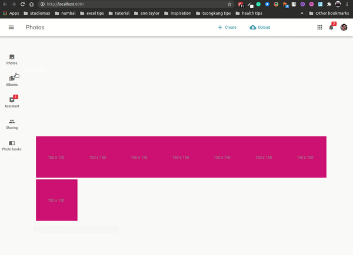

# laravel-quasar-photoalbums 2021
This an attempt to learn 2 frameworks and create a project within 24 hours.  A chance to land a job while having fun learning.  Even I don't land this job I'll continue these technologies for my other projects.

It's a Photo album app made using Quasar and Laravel.  A simple CRUD for the photos, and albums.  Eloquent  ORM should be used.  Following coding standards to both frameworks.  The data should be seeded from a JSON file.  

Aside from that, I added the migration class.  Make the UI as beautiful as possible.  Proper documentation of API, codes, etc are also added.

## Main Technologies:
- [Laravel 8](https://laravel.com/).
- [Quasar](https://laravel.com/docs/routing).
- [Axios](). 
- [fruitcake/laravel-cors]()
- and some many more

## Setup
- setup .env

```bash
APP_NAME=Laravel
APP_ENV=local
APP_KEY=
APP_DEBUG=true
APP_URL=http://localhost

LOG_CHANNEL=stack
LOG_LEVEL=debug

DB_CONNECTION=mysql
DB_HOST=127.0.0.1
DB_PORT=3306
DB_DATABASE=photoalbums
DB_USERNAME={dbnamehere}
DB_PASSWORD=handsomedaddy(.)

BROADCAST_DRIVER=log
CACHE_DRIVER=file
QUEUE_CONNECTION=sync
SESSION_DRIVER=file
SESSION_LIFETIME=120

MEMCACHED_HOST=127.0.0.1
```

- add database "photoalbums"
- then run this commands:

```bash
npm i && composer install && cd quasarphotoalbums && npm i && quasar build && cd .. && npm run dev 
```

```bash
php artisan migrate && php artisan db:seed 
```


## Quasar source code
```bash
quasarphotoalbums
```
### How it looks like


## running
```bash
php artisan serve
```

## API documentation: 
https://www.getpostman.com/collections/94d52dc431eabcc7ac4d